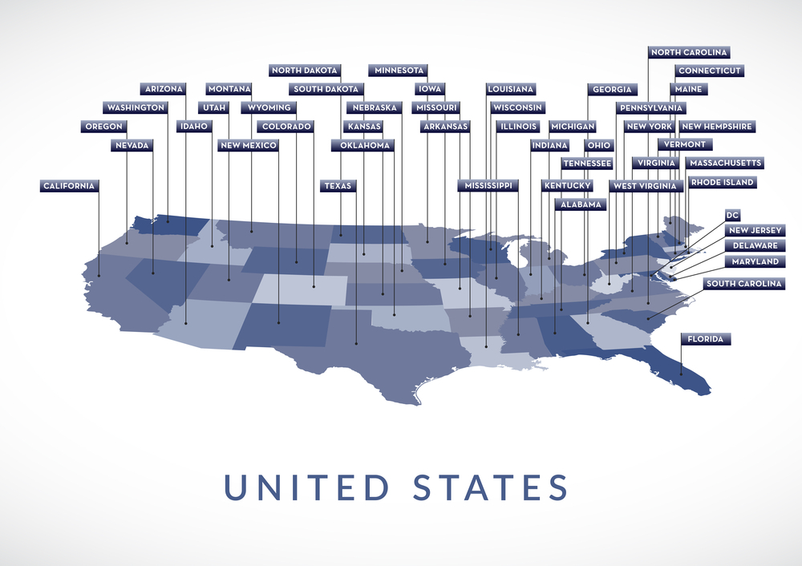

# <u>**U.S. States Game Project**</u>

## A game to find your knowledge of names of all the states in the United States.  

The game has an empty map of the United States. The user will be prompted for 
guessing the name of a state. Whenever the user guesses the states name right, 
the name will be placed on the map.    

    
### <u>**Project:**</u>  
U.S. States Game Project 
100 Days of Code - The Complete Python Pro Bootcamp 2021  
Day 25 - Intermediate - Working with CSV Data and the Pandas Library